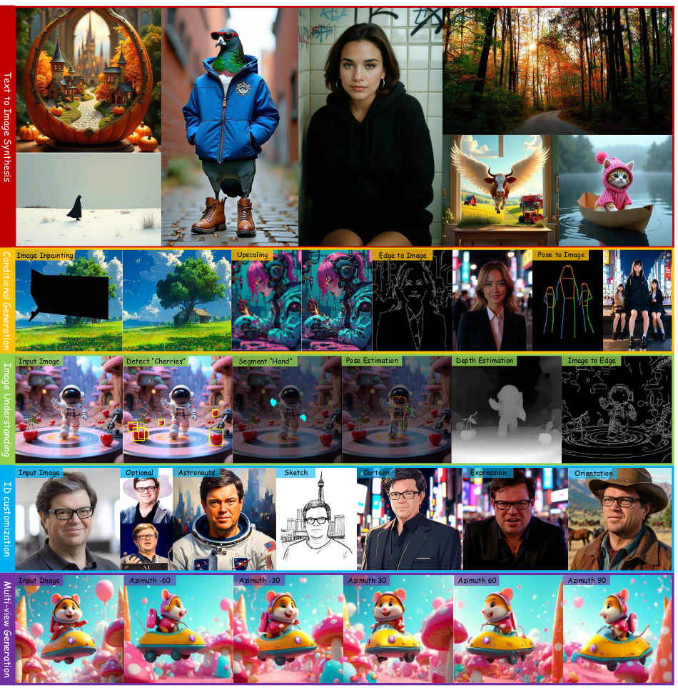
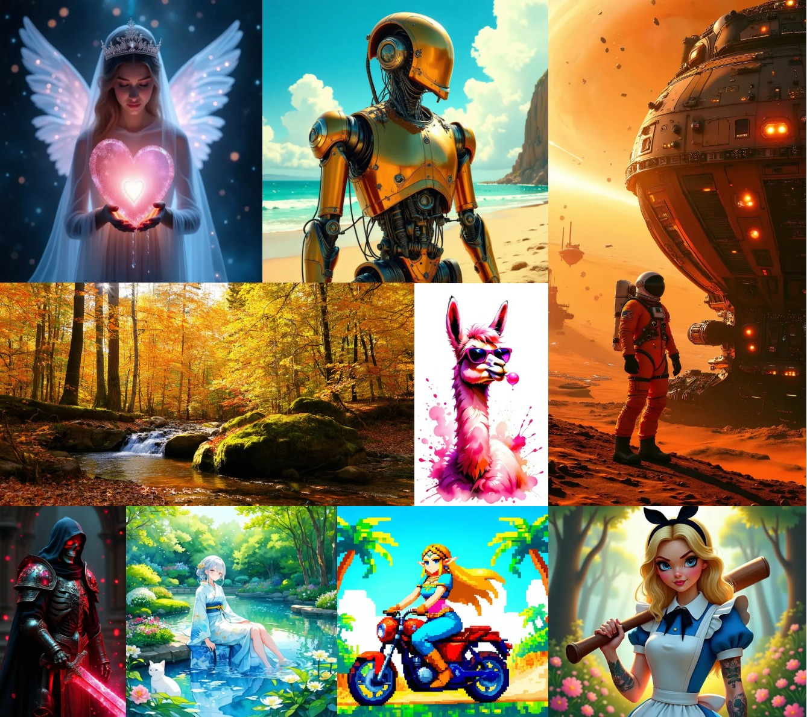
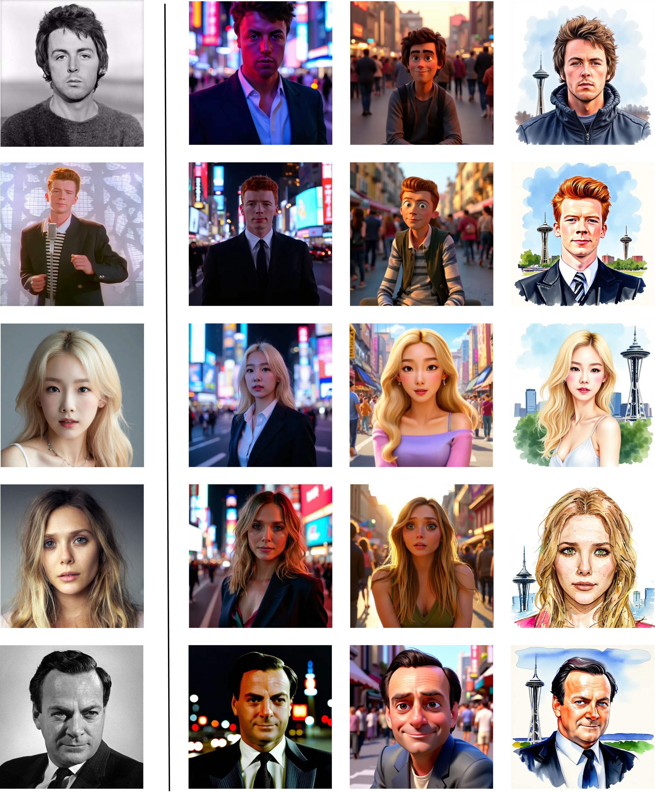
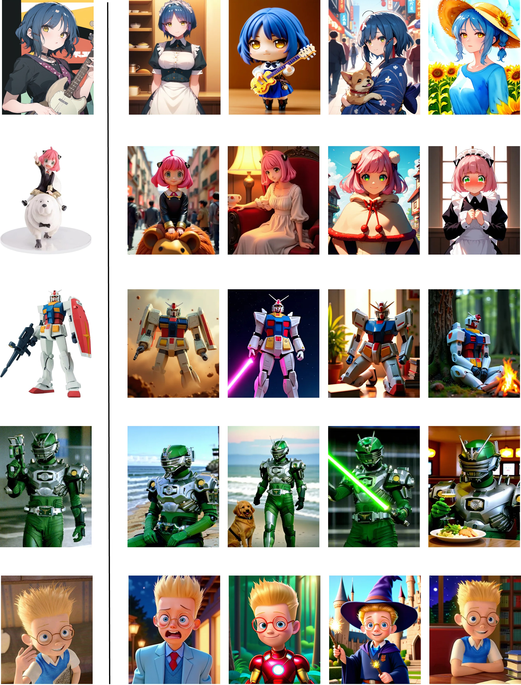
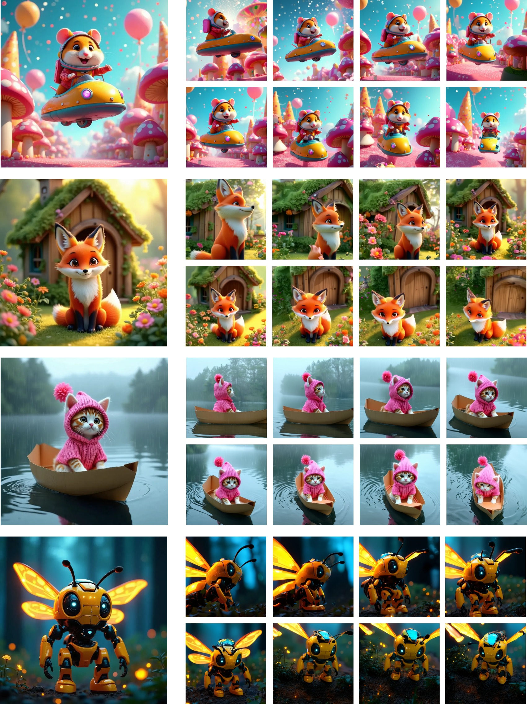
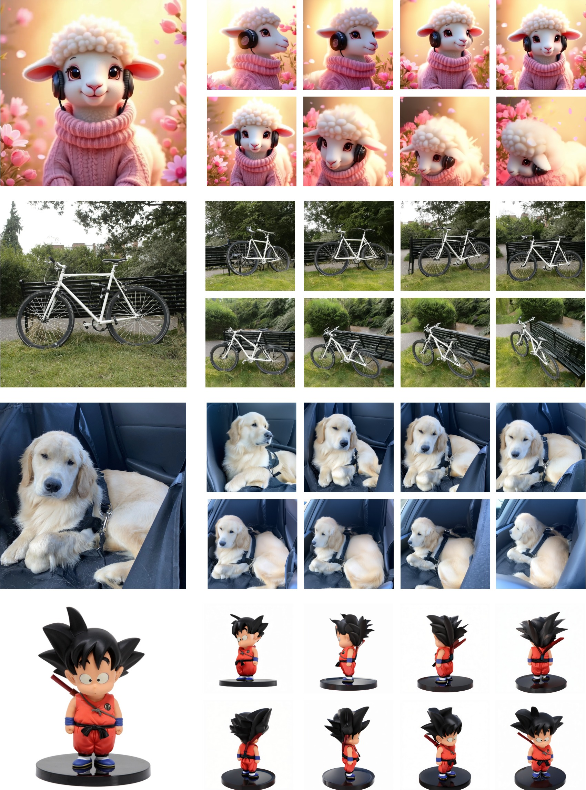
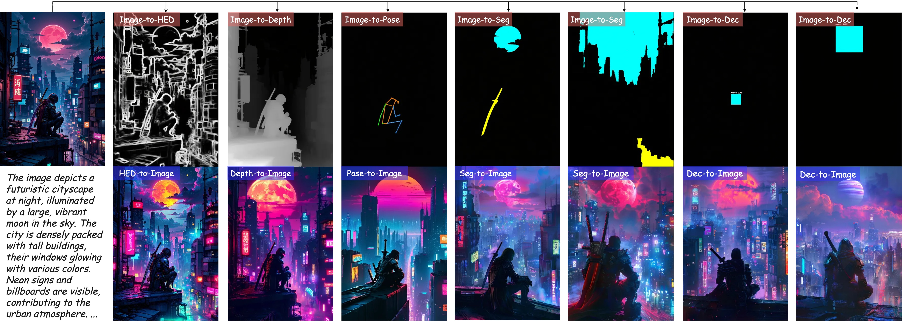
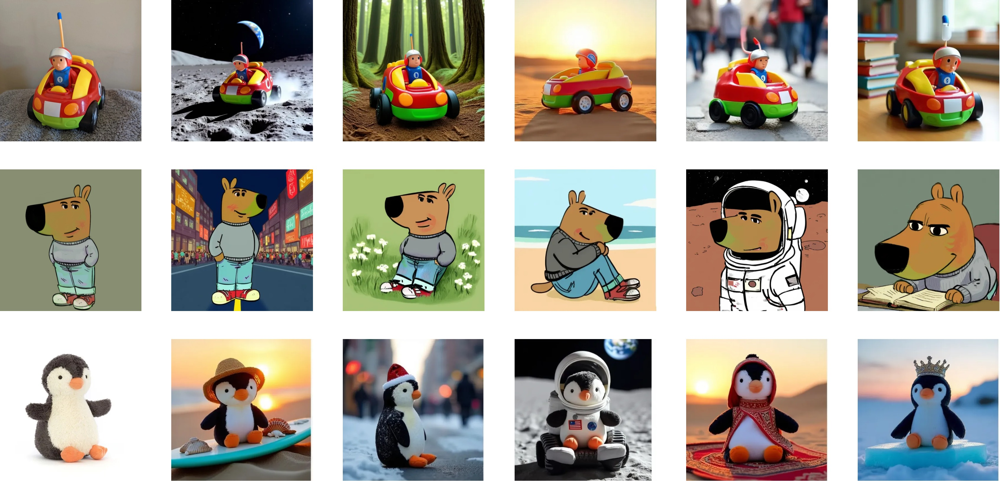
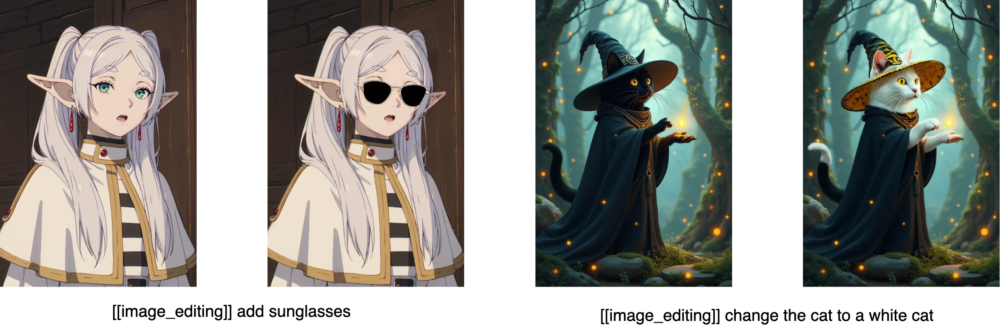
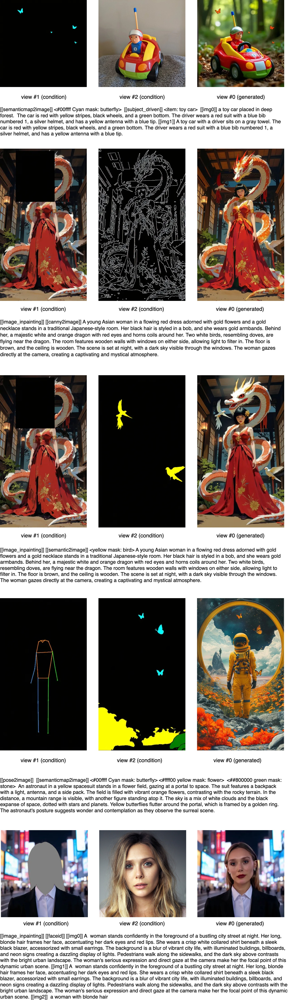

# One Diffusion to Generate Them All

<p align="left">
    <a href="https://lehduong.github.io/OneDiffusion-homepage/">
        
    </a>
    <a href="https://arxiv.org/abs/2411.16318">
            
    </a>
    <a href="https://huggingface.co/spaces/lehduong/OneDiffusion">
        
    </a>
    <a href="https://huggingface.co/lehduong/OneDiffusion">
        
    </a>    
</p>

<h4 align="left">
    <p>
        <a href=#news>News</a> |
        <a href=#quick-start>Quick start</a> |
        <a href=https://github.com/lehduong/OneDiffusion/blob/main/PROMPT_GUIDE.md>Prompt guide &  Supported tasks </a> |
        <a href=#qualitative-results>Qualitative results</a> |
        <a href="#license">License</a> |
        <a href="#citation">Citation</a>
    <p>
</h4>


<p align="center">
  
</p>


This is official repo of OneDiffusion, a versatile, large-scale diffusion model that seamlessly supports bidirectional image synthesis and understanding across diverse tasks. 

**For more detail, read our paper [here](https://arxiv.org/abs/2411.16318).**

## News
- 📦 2024/12/11: [Huggingface space](https://huggingface.co/spaces/lehduong/OneDiffusion) is online. Reduce the VRAM requirements for running demo with Molmo to 21GB.
- 📦 2024/12/10: Released [weight](https://huggingface.co/lehduong/OneDiffusion) and inference code.
- ✨ 2024/12/06: Added image editing from instruction.
- ✨ 2024/12/02: Added subject-driven generation

## Installation
```
conda create -n onediffusion_env python=3.8 &&
conda activate onediffusion_env &&
pip install torch==2.3.1 torchvision==0.18.1 torchaudio==2.3.1 --index-url https://download.pytorch.org/whl/cu118 &&
pip install "git+https://github.com/facebookresearch/pytorch3d.git" &&
pip install -r requirements.txt
```

## Quick start

Check `inference.py` for more detailed. For text-to-image, you can use below code snipe.

```
import torch
from onediffusion.diffusion.pipelines.onediffusion import OneDiffusionPipeline

device = torch.device('cuda:0')

pipeline = OneDiffusionPipeline.from_pretrained("lehduong/OneDiffusion").to(device=device, dtype=torch.bfloat16)

NEGATIVE_PROMPT = "monochrome, greyscale, low-res, bad anatomy, bad hands, text, error, missing fingers, extra digit, fewer digits, cropped, worst quality, low quality, normal quality, jpeg artifacts, signature, watermark, username, blurry, artist name, poorly drawn, bad anatomy, wrong anatomy, extra limb, missing limb, floating limbs, disconnected limbs, mutation, mutated, ugly, disgusting, blurry, amputation"

output = pipeline(
    prompt="[[text2image]] A bipedal black cat wearing a huge oversized witch hat, a wizards robe, casting a spell,in an enchanted forest. The scene is filled with fireflies and moss on surrounding rocks and trees", 
    negative_prompt=NEGATIVE_PROMPT, 
    num_inference_steps=50,
    guidance_scale=4,
    height=1024, 
    width=1024,
)
output.images[0].save('text2image_output.jpg')
```

You can run the gradio demo with:
```
python gradio_demo.py --captioner molmo # [molmo, llava, disable]
```
The demo provides guidance and helps format the prompt properly for each task. 

- By default, it loads the **quantized** Molmo for captioning source images. ~~which significantly increases memory usage. You generally need a GPU with at least $40$ GB of memory to run the demo.~~ You generally need a GPU with at least $21$ GB of memory to run the demo. 

- Opting to use LLaVA can reduce this requirement to $\approx 27$ GB, though the resulting captions may be less accurate in some cases. 

- You can also manually provide the caption for each input image and run with `disable` mode. In this mode, the returned caption is an empty string, but you should still press the `Generate Caption` button so that the code formats the input text properly. The memory requirement for this mode is $\approx 12$ GB. 

Note that the above required memory can change if you use higher resolution or more input images.

## Qualitative Results

### 1. Text-to-Image
<p align="center">
  
</p>


### 2. ID customization

<p align="center">
  
</p>

<p align="center">
  
</p>

### 3. Multiview generation

Single image to multiview:

<p align="center">
  
</p>

<p align="center">
  
</p>

Text to multiview:

<p align="center">
  
</p>

### 4. Condition-to-Image and vice versa
<p align="center">
  
</p>

### 5. Subject-driven generation

We finetuned the model on [Subject-200K](https://huggingface.co/datasets/Yuanshi/Subjects200K) dataset (along with all other tasks) for additional 40k steps. The model is now capable of  subject-driven generation.

<p align="center">
  
</p>

### 6. Text-guide image editing

We finetuned the model on [OmniEdit](https://huggingface.co/datasets/TIGER-Lab/OmniEdit-Filtered-1.2M) dataset for additional 30K steps.

<p align="center">
  
</p>

### 7. Zero-shot Task combinations

We found that the model can handle multiple tasks in a zero-shot setting by combining condition images and task tokens without any fine-tuning, as shown in the examples below. However, its performance on these combined tasks might not be robust, and the model’s behavior may change if the order of task tokens or captions is altered. For example, when using both image inpainting and ID customization together, the target prompt and the caption of the masked image must be identical. If you plan to use such combinations, we recommend fine-tuning the model on these tasks to achieve better performance and simpler usage.


<p align="center">
  
</p>

## License

The model is trained on several non-commercially licensed datasets (e.g., DL3DV, Unsplash), thus, **model weights** are released under a CC BY-NC license as described in [LICENSE](https://github.com/lehduong/onediffusion/blob/main/LICENSE). 

## Citation

```bibtex
@misc{le2024diffusiongenerate,
      title={One Diffusion to Generate Them All}, 
      author={Duong H. Le and Tuan Pham and Sangho Lee and Christopher Clark and Aniruddha Kembhavi and Stephan Mandt and Ranjay Krishna and Jiasen Lu},
      year={2024},
      eprint={2411.16318},
      archivePrefix={arXiv},
      primaryClass={cs.CV},
      url={https://arxiv.org/abs/2411.16318}, 
}
```
